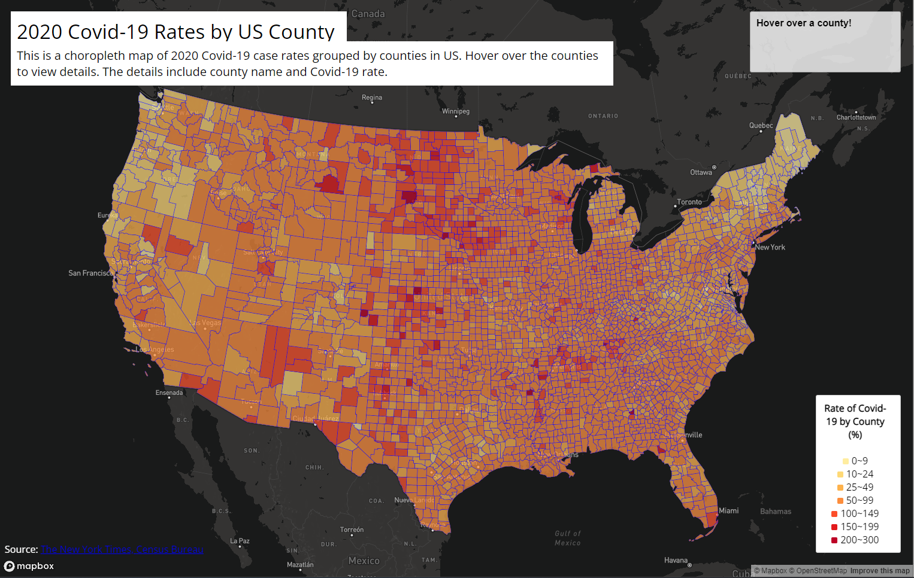
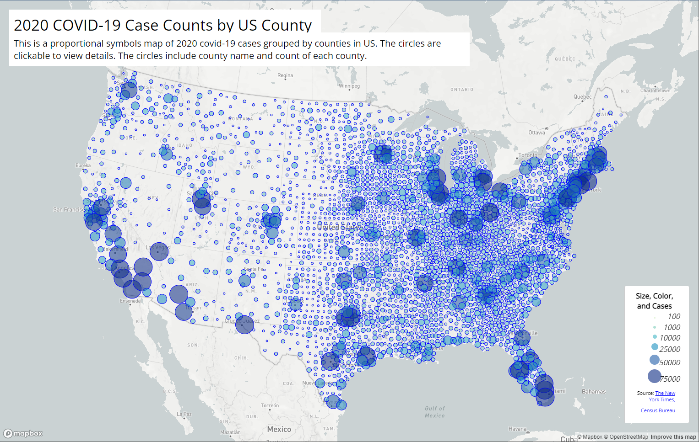

# Thematic Maps of COVID-19 in US
For this lab we were able to navigate through the introductory skills of Mapbox library in Javascript. With the Mapbox library, I was able to create two maps. One is a 2020 Covid-19 case count by county proportional symbols map and the other is a 2020 Covid-19 rates by county choropleth map.

# Maps
## 2020 Covid-19 Case Rate by County in US Choropleth Map

[Link to Choropleth Map](map1.html)

## 2020 Covid-19 Case Count by County in US Proportional Symbols Map

[Link to Porportional Symbols Map](map2.html)

#Source of Data
All the data were collected from [New York Times](https://github.com/nytimes/covid-19-data/blob/43d32dde2f87bd4dafbb7d23f5d9e878124018b8/live/us-counties.csv), [2018 ACS 5 year estimates](https://data.census.gov/cedsci/table?g=0100000US.050000&d=ACS%205-Year%20Estimates%20Data%20Profiles&tid=ACSDP5Y2018.DP05&hidePreview=true), and the [US Census Bureau](https://www.census.gov/geographies/mapping-files/time-series/geo/carto-boundary-file.html). The Data has been processed by
[Steven Bao](https://github.com/jakobzhao) and his colleagues.